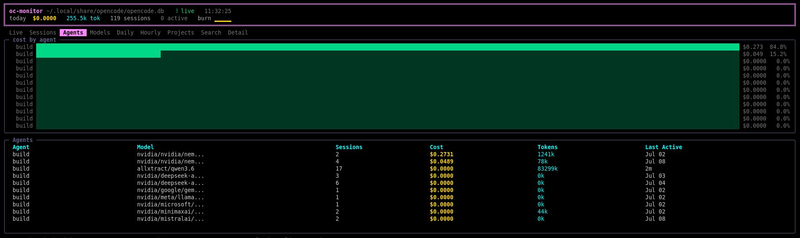
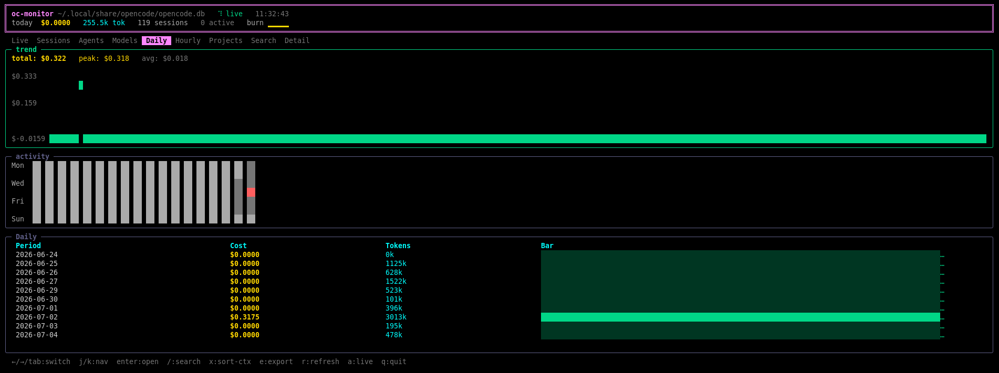

# oc-monitor

A real-time terminal UI for monitoring [OpenCode](https://github.com/anomalyco/opencode) sessions, costs, and usage — built with Bubble Tea.

## Features

- **Live monitoring** — See active OpenCode sessions in real time with burn-rate chart
- **Cost tracking** — Track spending down to the cent across agents, models, and projects
- **Usage analytics** — Daily and hourly spend trends with calendar heatmap
- **Model registry** — Automatic context window lookups from [models.dev](https://models.dev)
- **Session detail** — Open any session to inspect its messages, tool calls, and token breakdown
- **Search** — Full-text search across all your sessions
- **Sorting** — Sort sessions by context window usage
- **Export** — Export data as JSON for your own analysis

## Screenshots

| Live View                                                                   | Sessions View                                                                   |
| --------------------------------------------------------------------------- | ------------------------------------------------------------------------------- |
|  |  |
| Real-time agent status and burn rate                                        | List of all sessions with cost and token data                                   |

## Requirements

- [OpenCode](https://github.com/opencode-ai/opencode) installed and run at least once (creates `opencode.db`)
- Go 1.21+ (to build from source)

## Installation

### Option 1: Download pre-built binary

1. Download the latest release for your platform from [Releases](../../releases)
2. Make it executable:
   ```bash
   chmod +x oc-monitor
   ```
3. Run it:
   ```bash
   ./oc-monitor
   ```

### Option 2: Install from source

```bash
go install github.com/bikky/oc-monitor@latest
```

### Option 3: Build locally

```bash
git clone https://github.com/bikky/oc-monitor.git
cd oc-monitor
go build -o oc-monitor ./cmd/oc-monitor
./oc-monitor
```

## Configuration

### Database Path

oc-monitor looks for the OpenCode database at `~/.local/share/opencode/opencode.db` by default.

To use a custom database path, set the `OPENCODE_DB` environment variable:

```bash
export OPENCODE_DB=/path/to/opencode.db
./oc-monitor
```

### Debug Logging

Enable debug logging by setting `DEBUG`:

```bash
DEBUG=1 ./oc-monitor
```

Logs are written to `debug.log` in the current directory.

### Model Registry

oc-monitor automatically fetches model metadata (context window sizes) from [models.dev](https://models.dev) and caches it locally. This happens in the background while you use the app. The cache is stored at `~/.cache/oc-monitor/models.json` and refreshed every 24 hours.

## Usage

### Navigation

| Key                     | Action                                                                                 |
| ----------------------- | -------------------------------------------------------------------------------------- |
| `←` / `→` / `Tab`       | Switch between views (Live, Sessions, Agents, Models, Daily, Hourly, Projects, Search) |
| `j` / `k` / `↑` / `↓`   | Move up/down in the table                                                              |
| `Page Down` / `Page Up` | Scroll by page                                                                         |
| `g` / `G`               | Jump to top / bottom                                                                   |
| `Enter`                 | Open session detail view                                                               |
| `/`                     | Search sessions                                                                        |
| `x`                     | Sort sessions by context window usage                                                  |
| `e`                     | Export current view data as JSON                                                       |
| `r`                     | Refresh data                                                                           |
| `a`                     | Switch to Live view                                                                    |
| `q` / `Ctrl+C`          | Quit                                                                                   |

### Detail View

When you open a session:

| Key                     | Action                         |
| ----------------------- | ------------------------------ |
| `j` / `k` / `↑` / `↓`   | Scroll through session content |
| `Page Down` / `Page Up` | Scroll by page                 |
| `g` / `G`               | Jump to top / bottom           |
| `esc` / `Backspace`     | Go back to table               |

## Data

oc-monitor reads from the OpenCode SQLite database. All data is stored locally — nothing is sent to any server (except the optional models.dev registry lookup for context window sizes).

Exported JSON files are saved to `~/oc-monitor-exports/`.

## Architecture

```
cmd/oc-monitor/main.go   — Entry point
internal/db/             — Database access (SQLite, helpers, queries)
internal/registry/       — Model registry (models.dev API client + cache)
internal/tui/            — Terminal UI (Bubble Tea component)
```

## License

MIT
